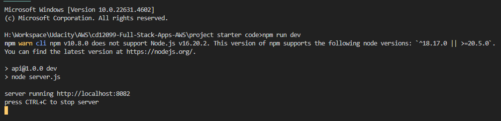
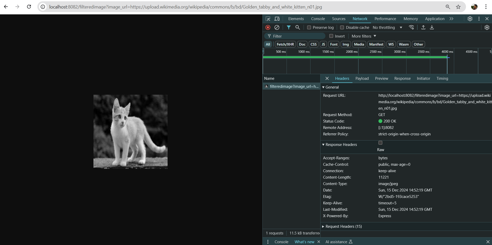
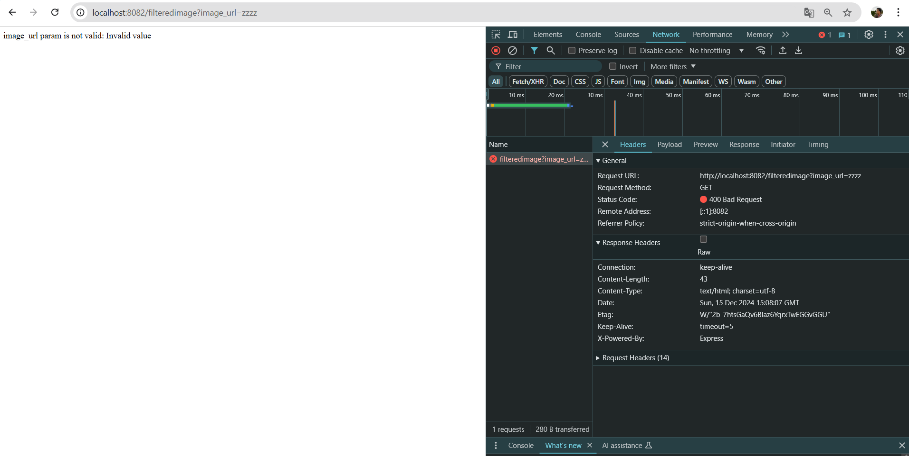
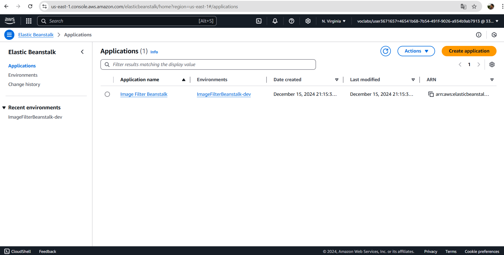
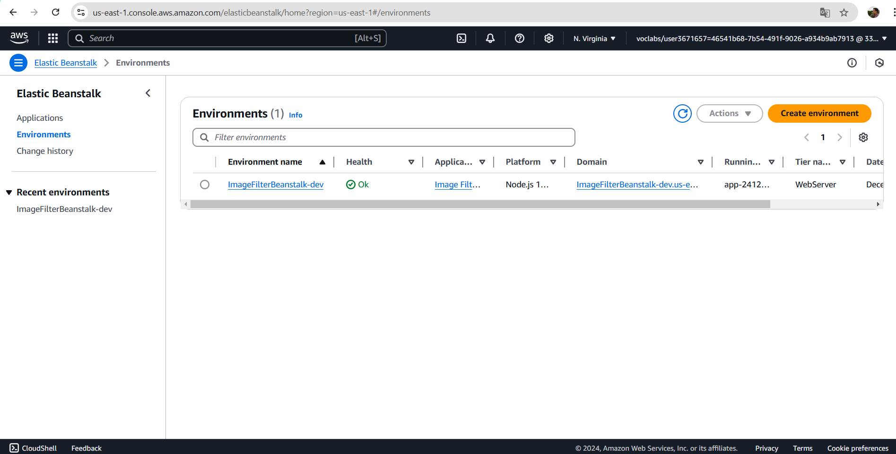
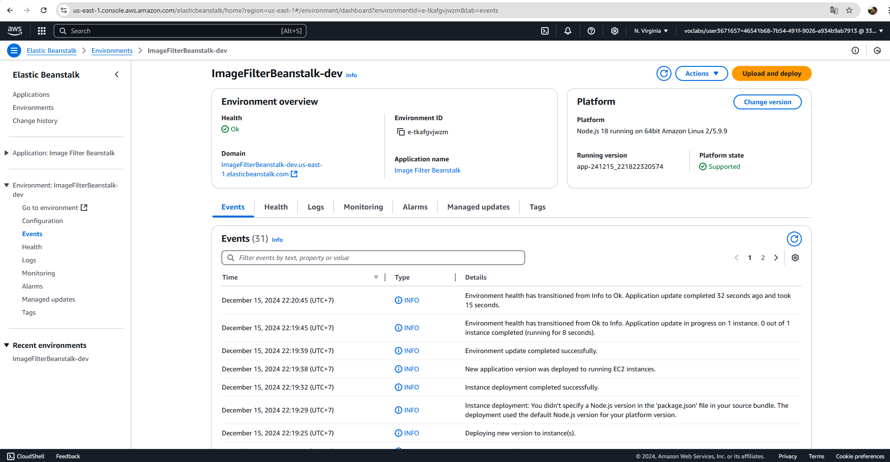
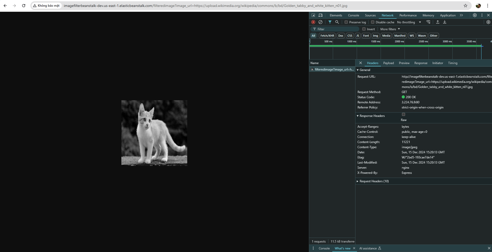
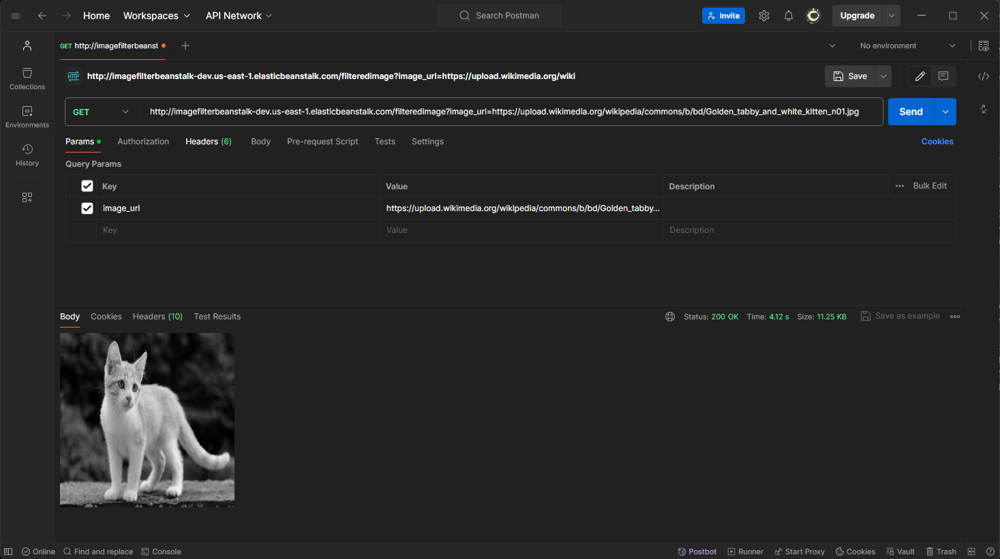

# I. Development Server

## 1. The project demonstrates a working NodeJS service

Starting the server with "npm run dev" runs a local instance of the server with no errors

## 2. The project demonstrates RESTFUL design principles

The stubbed @TODO1 endpoint in "server.js" is completed and accepts valid requests including: http://localhost:8082/filteredimage?image_url=https://upload.wikimedia.org/wikipedia/commons/b/bd/Golden_tabby_and_white_kitten_n01.jpg

## 3. The project demonstrates an appropriate use of HTTP status codes

Successful responses have a 200 code (refer about capture), at least one error code for caught errors.

# II. Elastic Beanstalk Deployment

## 1. The project uses AWS Elastic Beanstalk’s CLI and Console Dashboard

The project was deployed using the AWS Elastic Beanstalk CLI "eb init", "eb create", and "eb deploy" commands.
screenshots of the elastic beanstalk application dashboard

### Application

### Enviroment

## 2. The project includes functional cloud deployments

An endpoint URL for a running elastic beanstalk deployment (EB_URL) has been submitted along with the project submission. This endpoint responds to valid GET requests including:
http://imagefilterbeanstalk-dev.us-east-1.elasticbeanstalk.com/filteredimage?image_url=https://upload.wikimedia.org/wikipedia/commons/b/bd/Golden_tabby_and_white_kitten_n01.jpg

